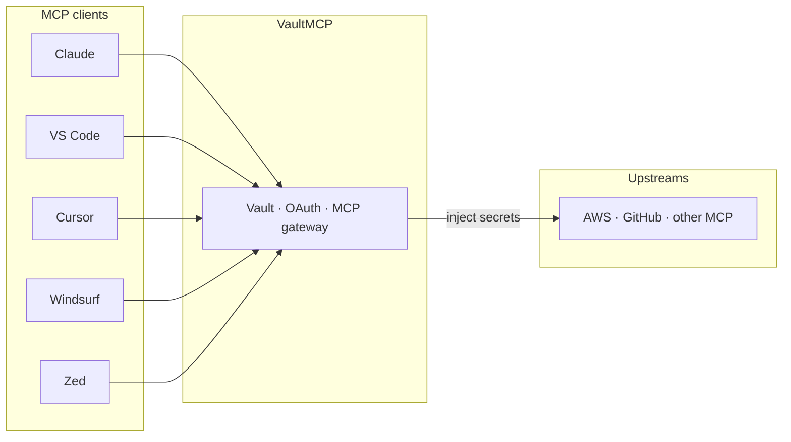

<div align="center">

# VaultMCP

[](LICENSE)
[](https://vaultmcp.dev)

**Keep API keys out of your AI IDE.**

VaultMCP is an encrypted secret vault and MCP gateway. You store provider credentials once. Your AI IDE connects to one endpoint. VaultMCP decrypts secrets only when calling upstream MCP servers — your agents and config files never see the raw keys.

<table>
  <tr>
    <td align="center">
      
    </td>
    <td align="center">
      
    </td>
  </tr>
</table>

Built by **Axiler Labs** · Product: **[vaultmcp.dev](https://vaultmcp.dev)**


&nbsp;&nbsp;&nbsp;

&nbsp;&nbsp;&nbsp;

&nbsp;&nbsp;&nbsp;

&nbsp;&nbsp;&nbsp;


<sub>Works with any MCP client — Claude Desktop, VS Code, Cursor, Windsurf, Zed, and more.</sub>

| **Product** | **Self-host** | **For** | **License** |
|:-----------:|:-------------:|:-------:|:-----------:|
| [vaultmcp.dev](https://vaultmcp.dev) | `https://YOUR_HOST` | AI IDEs + MCP secrets | [AGPL-3.0](LICENSE) |

</div>

## How it works

<div align="center">

One vault. One MCP URL. Every IDE talks to VaultMCP — not to your raw AWS or GitHub keys.

```text
  Claude   VS Code   Cursor   Windsurf   Zed
     │        │         │         │       │
     └────────┴────┬────┴─────────┴───────┘
                   ▼
            ┌─────────────┐
            │  VaultMCP   │  encrypt · authorize · inject
            │  vaultmcp.dev│
            └──────┬──────┘
                   ▼
         AWS · GitHub · other MCP servers
```

</div>

1. **Sign in** with GitHub and create a workspace on [vaultmcp.dev](https://vaultmcp.dev).
2. **Store secrets** once (encrypted at rest — see [Encryption](#encryption)). Share with teammates when needed.
3. **Point your IDE** at `https://vaultmcp.dev/mcp` (or your self-hosted `/mcp`).
4. **Call tools** like `aws__…` / `github__…`. Credentials are injected server-side — never pasted into `mcp.json`.



## Features

- **Write-only vault** — list APIs, MCP responses, and audit logs never return secret values
- **Server-side injection** — decryption only happens inside the API when calling an upstream
- **Private and shared secrets** — per-user or workspace-wide visibility
- **GitHub OAuth or personal tokens** — browser login for IDEs, or `vmcp_…` tokens in `Authorization`
- **Namespaced tools** — register upstreams once; call them as `provider__tool_name`
- **Single public port** — Docker Compose exposes port 80; API and UI stay on the internal network
- **Optional CLI** — inject shared workspace secrets into local `npm run dev` (and similar) without sharing `.env` files

## Quick start (local)

**Need:** Node.js 22+, pnpm 9, Docker (Postgres + Redis), and a [GitHub OAuth App](https://github.com/settings/developers).

```bash
git clone https://github.com/Axiler-Lab/vaultmcp.git
cd vaultmcp
cp .env.example .env
```

Fill in at least: `VAULT_MASTER_KEY`, `GITHUB_CLIENT_ID`, `GITHUB_CLIENT_SECRET`, `PUBLIC_URL`, `WEB_ORIGIN`, `DATABASE_URL`, `REDIS_URL`. Local defaults are in [`.env.example`](.env.example).

**GitHub OAuth App**

| Field        | Local (pnpm)                                 | Docker Compose (port 80)                     |
| ------------ | -------------------------------------------- | -------------------------------------------- |
| Homepage URL | `http://localhost:5173`                      | `http://YOUR_SERVER_IP`                      |
| Callback URL | `http://localhost:3001/auth/github/callback` | `http://YOUR_SERVER_IP/auth/github/callback` |

The callback must match `PUBLIC_URL`.

```bash
docker compose up -d postgres redis
pnpm install
pnpm --filter @vaultmcp/shared build
pnpm db:generate   # first time / after schema changes
pnpm db:migrate
pnpm dev:api       # :3001
pnpm dev:web       # :5173
```

Open [http://localhost:5173](http://localhost:5173) → sign in → create a workspace → add secrets → register an upstream ([AWS example](examples/aws-upstream.md)). Host-run AWS `uvx` upstreams need [`uv`](https://docs.astral.sh/uv/) on your `PATH`.

## Docker Compose

One public entrypoint on **port 80**. API and web are not published directly.

```bash
cp .env.example .env
# Set PUBLIC_URL, WEB_ORIGIN, GITHUB_*, VAULT_MASTER_KEY
# VITE_API_URL=          # empty = same-origin
# COOKIE_SECURE=false    # true behind HTTPS

docker compose up --build
```

| Surface         | URL                                                                                                            |
| --------------- | -------------------------------------------------------------------------------------------------------------- |
| Web UI          | [http://localhost/](http://localhost/)                                                                         |
| Health          | [http://localhost/health](http://localhost/health)                                                             |
| MCP             | [http://localhost/mcp](http://localhost/mcp)                                                                   |
| OAuth discovery | [http://localhost/.well-known/oauth-protected-resource](http://localhost/.well-known/oauth-protected-resource) |

Migrations run when the API container starts. Production notes: [docs/DEPLOY.md](docs/DEPLOY.md).

## Connect Cursor (or any MCP client)

Same config shape for **Cursor**, **Claude Desktop**, **VS Code**, **Windsurf**, **Zed**, and other MCP clients. Use OAuth (browser login) or a personal access token from the dashboard **Connect** tab. Never put provider secrets in client config.

**OAuth** (hosted)

```json
{
  "mcpServers": {
    "vaultmcp": {
      "url": "https://vaultmcp.dev/mcp"
    }
  }
}
```

**Personal token** (`vmcp_…` from Connect)

```json
{
  "mcpServers": {
    "vaultmcp": {
      "url": "https://vaultmcp.dev/mcp",
      "headers": {
        "Authorization": "Bearer vmcp_…"
      }
    }
  }
}
```

Self-host: replace with `https://YOUR_HOST/mcp`. Local API: `http://localhost:3001/mcp`.

Cursor: `~/.cursor/mcp.json` or `.cursor/mcp.json`. Other clients use their own MCP config path.

After auth: `list_workspaces` → `use_workspace` → call namespaced tools (`github__…`, `aws__…`).

## Local env CLI (optional)

For shared team secrets in local apps (not MCP agents), use [`@vaultmcp-axiler/cli`](https://www.npmjs.com/package/@vaultmcp-axiler/cli):

```bash
npx @vaultmcp-axiler/cli@latest login --token vmcp_… --url https://YOUR_HOST
npx @vaultmcp-axiler/cli@latest run -w your-slug -- npm run dev
```

Create a PAT with the **Runtime env (CLI)** preset (`env` scope only). MCP tokens and env tokens are not interchangeable. Prefer `run` over `env` so secrets stay in the child process.

Full guide: **[docs/CLI.md](docs/CLI.md)**.

## Encryption

Secret **values** are encrypted at rest with **AES-256-GCM** using envelope encryption:

- Each workspace has its own data encryption key (DEK)
- DEKs are wrapped by `VAULT_MASTER_KEY` (kept out of the database)
- GCM AAD binds ciphertext to the `workspaceId`, so blobs cannot be swapped across workspaces
- Decryption happens only server-side — for MCP upstream injection, or opt-in CLI export
- Secret **names** and other metadata are **not** encrypted (so the UI can list and authorize without decrypting)

Treat `VAULT_MASTER_KEY` as a root credential. Rotate provider secrets in the UI without changing IDE config.

Also: list APIs and audit logs never return plaintext values; viewers cannot invoke secret-backed tools or export runtime env.

Details: **[docs/CRYPTO.md](docs/CRYPTO.md)**.

## Repository layout

```
apps/api            Gateway, OAuth, REST, upstream proxy
apps/web            Control plane UI
packages/shared     Crypto helpers + shared schemas
packages/cli        Local env injection CLI
deploy/             Reverse proxy config
docs/               Deploy, CLI, and crypto guides
examples/           Upstream walkthroughs
```

## Why AGPL

VaultMCP is often run as a network service. **AGPL-3.0-only** means if you modify it and offer that service over a network, you must share the corresponding source. That keeps hosted forks honest while still allowing self-hosting and contribution.

## Contributing

VaultMCP is an open-source project from **Axiler Labs**. We’d love help from the community — issues and pull requests are very welcome, especially around security, reliability, docs, and MCP compatibility.

Ways to help:

- [Open an issue](https://github.com/Axiler-Lab/vaultmcp/issues) for bugs or clear feature ideas
- [Send a pull request](https://github.com/Axiler-Lab/vaultmcp/pulls) (small, focused changes are easiest to review)
- Improve docs and examples for common upstreams

By contributing, you agree your work is licensed under **AGPL-3.0-only**, same as the rest of the repo. Never commit secrets; use `.env.example` for variable names only.

Learn more at **[vaultmcp.dev](https://vaultmcp.dev)** · Axiler Labs: **[axiler.com](https://axiler.com)**.

## License

Copyright © 2026 **Axiler Labs**.

VaultMCP is licensed under the [GNU Affero General Public License v3.0 only](LICENSE) (`AGPL-3.0-only`).
